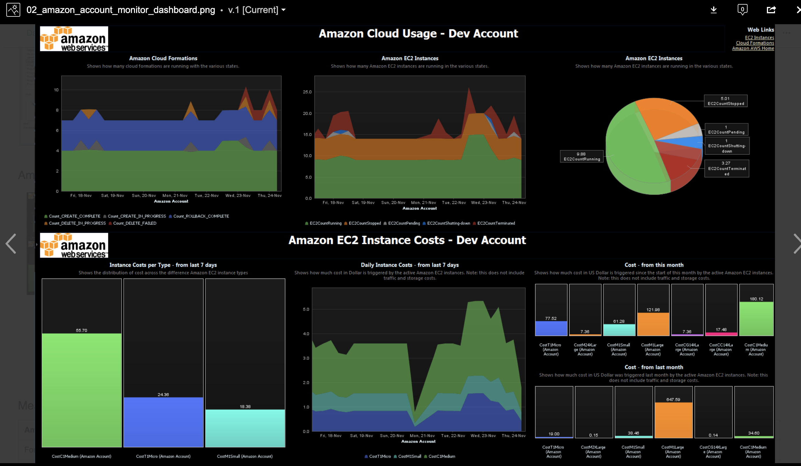

<h1 align="center"> AWS Cost Utility<project-name></h1>

## Overview
Provide an automated mechanism to pull metrics from AWS Billing and Cost Management APIs and ingest them into Dynatrace for charting and Dashboard visualization.

<p align="center">
  
</p>

### Prerequisites
- bash shell
- Linux
- git
- AWS instance with AWS Cost API enabled


<project-description></p>
<p align="center"><i>Resolve the mystery of where your AWS costs go.<project-description></i></p>


### Step 1: Getting Started

1. Granting IAM permissions to use the AWS Cost Explorer API<br>
An IAM user must be granted explicit permission to query the AWS Cost Explorer API. For the policy that grants the necessary permissions to an IAM user. Your IAM role once created the last box will have the access key and secret key. you can also use AWS CLI to create the role. This would be a one time creation.  For achedemic simplicity, the following will suffice, until security matters.


2. Pull down the code repo to the host where AWSCost Utility will run.

   ```bash
   git clone https://github.com/nishantrama/AWSCost
   ```

3. Change directories.

    ```bash
    cd AWSCost
    ```

### Step 2. Create keys and grant AWSCost Utility access to your 

4. Review the following Dynatrace documentation [Metric ingestion protocol](https://www.dynatrace.com/support/help/how-to-use-dynatrace/metrics/metric-ingestion/metric-ingestion-protocol).

### Step 3. Execute the script to start the AWS Cost daemon. 

1. Create AWS keys to allow access to your AWSCost Utility Daemon

   ```bash
   <blah, blah, blah>
   ```

2. Start the script.

   ```bash
   node src/start_AWSCost_Utility
   ```

3. Verify console for any errors.  Resolve errors.  <Magic happens here>


### Step 4. Query Data in DT Data Explorer

1. Dynatrace UI -> Explore Data -> AWS.cost.total<?> -> Max -> Split by name


## TODO
1. Detect and display if OA is/not installed on EC2 Instance

2. Rewrite in Python for portability to all environments

3. Verify Plugin is actually running on EC2 instance before deploying

4. Integrate [AWS GetRightSizing Recommendations](
https://docs.aws.amazon.com/aws-cost-management/latest/APIReference/API_GetRightsizingRecommendation.html)

5. Expand support to other cloud solutions 

6. Make this work on non-OA monitored environment

7. Refine AWS permissions to minimum set.
